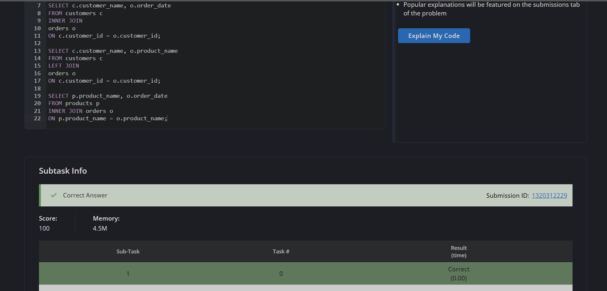
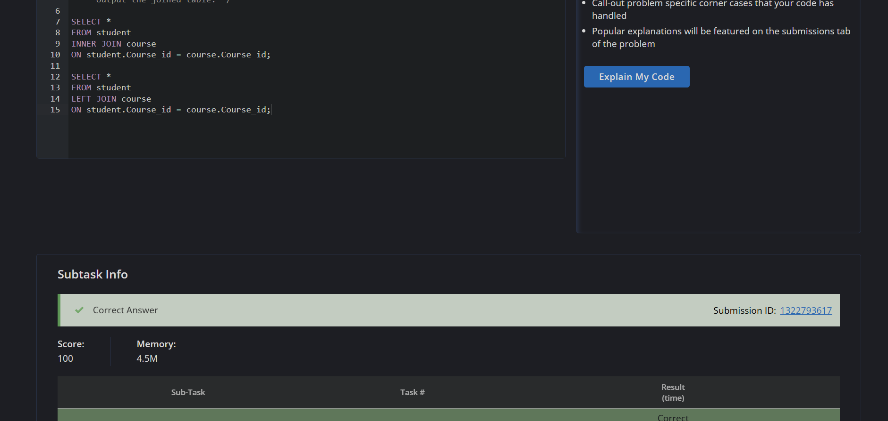
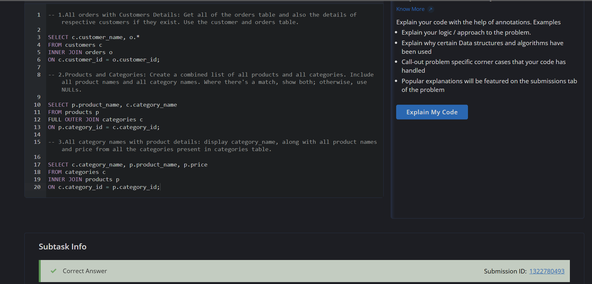
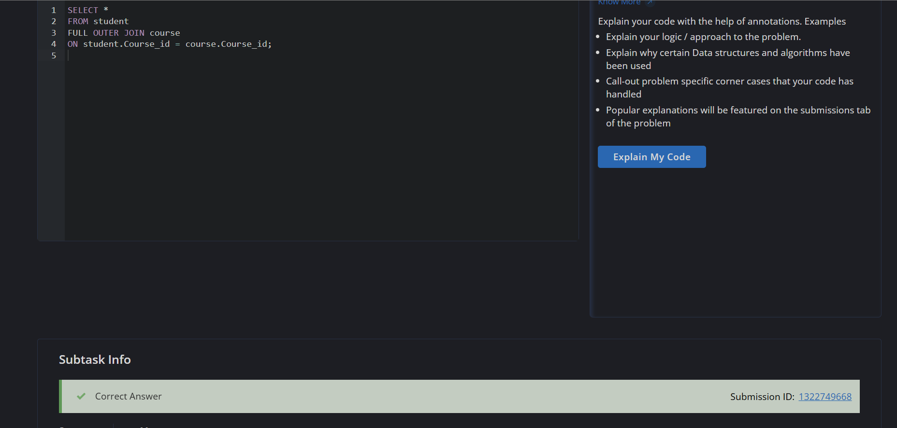
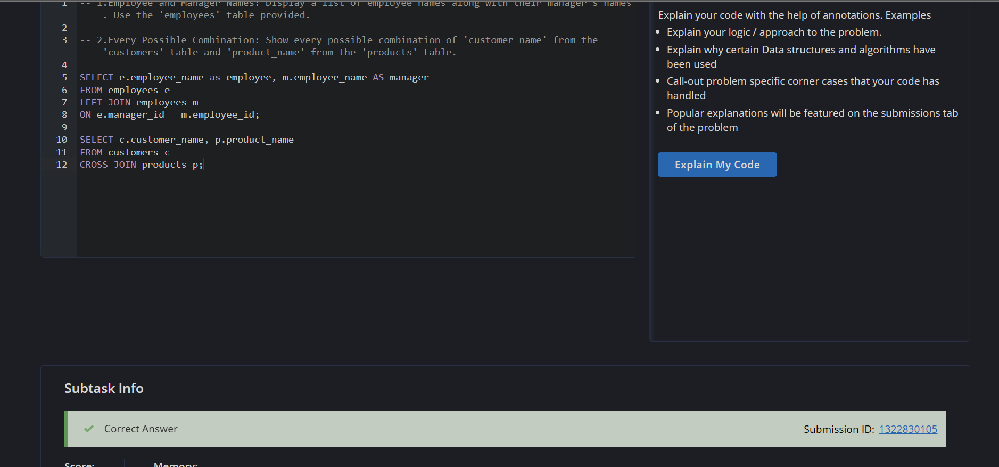

# Experiment 4 --- SQL JOIN Operations

**Course:** Advanced Database Management Systems (ADBMS)\
**Student:** Ashwin Anand\
**UID:** 25BCS80013

------------------------------------------------------------------------

# Experiment 4.1 --- SQL JOIN Practice (INNER JOIN & LEFT JOIN)

## Objective

To understand and implement different types of SQL JOIN operations for
combining data from multiple related tables.

The experiment covers:

-   `INNER JOIN`
-   `LEFT JOIN`

using a simple customer-order-product database.

------------------------------------------------------------------------

## Database Schema

### Table: `customers`

  customer_id   customer_name    city
  ------------- ---------------- -------------
  1             Alice Smith      New York
  2             Bob Johnson      Los Angeles
  3             Carol Williams   Chicago
  4             David Brown      Houston
  5             Emily Davis      Phoenix
  6             Luffy            NULL

### Table: `orders`

  order_id   customer_id   product_name   order_date   quantity
  ---------- ------------- -------------- ------------ ----------
  1          1             Laptop         2024-01-15   1
  2          1             Mouse          2024-01-15   2
  3          2             Keyboard       2024-01-20   1
  4          3             Monitor        2024-01-22   1
  5          2             Laptop         2024-02-01   2

### Table: `products`

  product_id   product_name   category_id   price
  ------------ -------------- ------------- -------
  1            Laptop         1             1200
  2            Mouse          2             25
  3            Keyboard       2             75
  4            Monitor        1             300
  5            Webcam         2             60
  6            Tablet         3             250

### Table: `categories`

  category_id   category_name
  ------------- ---------------
  1             Electronics
  2             Accessories
  3             Tablets

### Table: `employees`

  employee_id   employee_name   manager_id   department
  ------------- --------------- ------------ ------------
  1             John Doe        NULL         Sales
  2             Jane Smith      1            Sales
  3             Peter Jones     1            Marketing
  4             Mary Green      3            Marketing
  5             Raj             2            Sales

------------------------------------------------------------------------

# Question 1 --- Customers and Their Order Dates

## SQL Query

``` sql
SELECT c.customer_name, o.order_date
FROM customers c
INNER JOIN orders o
ON c.customer_id = o.customer_id;
```

------------------------------------------------------------------------

# Question 2 --- All Customers and Their Orders

## SQL Query

``` sql
SELECT c.customer_name, o.product_name
FROM customers c
LEFT JOIN orders o
ON c.customer_id = o.customer_id;
```
------------------------------------------------------------------------

# Question 3 --- Products That Were Ordered

## SQL Query

``` sql
SELECT p.product_name, o.order_date
FROM products p
INNER JOIN orders o
ON p.product_name = o.product_name;
```

### Screenshot

``` md

```

------------------------------------------------------------------------

## Concepts Covered

-   INNER JOIN
-   LEFT JOIN
-   Join Condition (`ON`)
-   Foreign Key relationships


---

# Experiment 4.2 — LEFT JOIN

## Objective

Understand the difference between `INNER JOIN` and `LEFT JOIN` by joining two related tables and observing how unmatched rows are handled.

---

## Problem Statement

Join the `student` and `course` tables using the `Course_id` column.

Perform the following operations:

1. Use an **INNER JOIN** to display only matching records.
2. Use a **LEFT JOIN** to display all students, even if they are not enrolled in any course.

---

## INNER JOIN Query

```sql
SELECT *
FROM student
INNER JOIN course
ON student.Course_id = course.Course_id;
```

### Explanation

- `INNER JOIN` returns only those rows where `Course_id` exists in both tables.
- Students without a matching course are excluded from the result.

### Expected Output

| St_id | St_Name | Department | Course_id | Course_id | Course_Name | Credits | Prof_id |
|-------|----------|------------|-----------|-----------|--------------|---------|---------|
|1001|John Smith|Computer Science|CS101|CS101|Introduction to Computer Science|3|2001|
|1002|Emily Brown|History|HIS102|HIS102|World History II|3|2004|
|1003|David Lee|Mathematics|MAT202|MAT202|Linear Algebra|2|2002|
|1004|Sarah Johnson|English|ENG201|ENG201|Advanced Writing|4|2003|

---

## LEFT JOIN Query

```sql
SELECT *
FROM student
LEFT JOIN course
ON student.Course_id = course.Course_id;
```

### Explanation

- `LEFT JOIN` returns every row from the **student** table.
- If a student has no matching course, SQL fills the course columns with `NULL`.
- This makes it useful when we want to preserve all records from the left table.

### Expected Output

| St_id | St_Name | Department | Course_id | Course_id | Course_Name | Credits | Prof_id |
|-------|----------|------------|-----------|-----------|--------------|---------|---------|
|1001|John Smith|Computer Science|CS101|CS101|Introduction to Computer Science|3|2001|
|1002|Emily Brown|History|HIS102|HIS102|World History II|3|2004|
|1003|David Lee|Mathematics|MAT202|MAT202|Linear Algebra|2|2002|
|1004|Sarah Johnson|English|ENG201|ENG201|Advanced Writing|4|2003|
|1005|Michael Chen|Biology|BIO103|NULL|NULL|NULL|NULL|

### Output Screenshot

```md

```

---

## INNER JOIN vs LEFT JOIN

| INNER JOIN | LEFT JOIN |
|------------|-----------|
| Returns only matching rows from both tables | Returns all rows from the left table |
| Unmatched rows are discarded | Unmatched rows are preserved with `NULL` values |
| Used when only related records are needed | Used when every record from the left table must appear |

---

## Key Concepts Learned

- `INNER JOIN`
- `LEFT JOIN`
- Matching vs non-matching rows
- `NULL` values produced by joins
- Join condition using `ON`


---

# Experiment 4.3 — SQL JOIN Practice (RIGHT JOIN & Multi-Table JOINs)

## Objective

Practice different SQL JOIN operations by combining data from multiple related tables.

This experiment demonstrates how to:

- Retrieve all records from one table while matching related records from another.
- Join products with their corresponding categories.
- Display category information along with product details.

---

## Database Schema

### Table: `customers`

| customer_id | customer_name | city |
|-------------|---------------|------|
| 1 | Alice Smith | New York |
| 2 | Bob Johnson | Los Angeles |
| 3 | Carol Williams | Chicago |
| 4 | David Brown | Houston |
| 5 | Emily Davis | Phoenix |
| 6 | Luffy | NULL |

---

### Table: `orders`

| order_id | customer_id | product_name | order_date | quantity |
|----------|-------------|--------------|------------|----------|
| 1 | 1 | Laptop | 2024-01-15 | 1 |
| 2 | 1 | Mouse | 2024-01-15 | 2 |
| 3 | 2 | Keyboard | 2024-01-20 | 1 |
| 4 | 3 | Monitor | 2024-01-22 | 1 |
| 5 | 7 | Webcam | 2023-02-12 | 3 |

---

### Table: `products`

| product_id | product_name | category_id | price |
|------------|--------------|-------------|------|
| 1 | Laptop | 1 | 1200 |
| 2 | Mouse | 2 | 25 |
| 3 | Keyboard | 2 | 75 |
| 4 | Monitor | 1 | 300 |
| 5 | Webcam | 2 | 60 |
| 6 | Tablet | 3 | 250 |

---

### Table: `categories`

| category_id | category_name |
|-------------|---------------|
| 1 | Electronics |
| 2 | Accessories |
| 3 | Tablets |

---

# Question 1 — All Orders with Customer Details

## Problem Statement

Display every order along with the corresponding customer information. If a customer record does not exist, the order should still appear.

### SQL Query

```sql
SELECT c.customer_name,
       o.order_id,
       o.customer_id,
       o.product_name,
       o.order_date,
       o.quantity
FROM customers c
RIGHT JOIN orders o
ON c.customer_id = o.customer_id;
```

### Explanation

- `RIGHT JOIN` returns every row from the **orders** table.
- Matching customer details are displayed when available.
- If an order has no matching customer (such as `customer_id = 7`), the customer columns contain `NULL`.

### Expected Output

| customer_name | order_id | customer_id | product_name | order_date | quantity |
|--------------|---------|------------|--------------|------------|----------|
| Alice Smith | 1 | 1 | Laptop | 2024-01-15 | 1 |
| Alice Smith | 2 | 1 | Mouse | 2024-01-15 | 2 |
| Bob Johnson | 3 | 2 | Keyboard | 2024-01-20 | 1 |
| Carol Williams | 4 | 3 | Monitor | 2024-01-22 | 1 |
| NULL | 5 | 7 | Webcam | 2023-02-12 | 3 |

---

# Question 2 — Products and Categories

## Problem Statement

Display every product together with its corresponding category.

### SQL Query

```sql
SELECT p.product_name,
       c.category_name
FROM products p
INNER JOIN categories c
ON p.category_id = c.category_id;
```

### Explanation

- The query joins the `products` and `categories` tables using `category_id`.
- Each product is displayed with its associated category.

### Expected Output

| product_name | category_name |
|--------------|---------------|
| Laptop | Electronics |
| Mouse | Accessories |
| Keyboard | Accessories |
| Monitor | Electronics |
| Webcam | Accessories |
| Tablet | Tablets |

---

# Question 3 — Categories with Product Details

## Problem Statement

Display every category together with the products that belong to it, including the product price.

### SQL Query

```sql
SELECT c.category_name,
       p.product_name,
       p.price
FROM categories c
LEFT JOIN products p
ON c.category_id = p.category_id;
```

### Explanation

- `LEFT JOIN` returns every category from the `categories` table.
- Matching products are displayed along with their prices.
- If a category has no products, the product columns contain `NULL`.

### Expected Output

| category_name | product_name | price |
|---------------|--------------|------:|
| Electronics | Laptop | 1200 |
| Accessories | Mouse | 25 |
| Accessories | Keyboard | 75 |
| Electronics | Monitor | 300 |
| Accessories | Webcam | 60 |
| Tablets | Tablet | 250 |

### Output Screenshot

```md

```

---

## Key Concepts Learned

| Concept | Description |
|---------|-------------|
| `RIGHT JOIN` | Returns all rows from the right table and matching rows from the left table. |
| `INNER JOIN` | Returns only rows that exist in both tables. |
| `LEFT JOIN` | Returns all rows from the left table and matching rows from the right table. |
| Join using Foreign Keys | Tables are related using `customer_id` and `category_id`. |
| Handling `NULL` Values | Unmatched records appear as `NULL` in joined columns. |

---

---

# Experiment 4.4 — FULL OUTER JOIN

## Objective

Understand the working of the `FULL OUTER JOIN` by combining two related tables while preserving **all rows** from both tables, regardless of whether matching records exist.

This experiment demonstrates how `FULL OUTER JOIN` combines the behavior of both `LEFT JOIN` and `RIGHT JOIN`.

---

## Problem Statement

Join the `student` and `course` tables using the `Course_id` column.

Display:

- All matching student-course records.
- Students who are not enrolled in any course.
- Courses that do not have any enrolled students.

---

## SQL Query

```sql
SELECT *
FROM student
FULL OUTER JOIN course
ON student.Course_id = course.Course_id;
```

---

## Explanation

- `FULL OUTER JOIN` returns **every row** from both tables.
- If a row exists in both tables, the matching records are combined.
- If a student has no matching course, the course columns contain `NULL`.
- If a course has no corresponding student, the student columns contain `NULL`.

It can be thought of as the combination of:

- `LEFT JOIN`
- `RIGHT JOIN`

---

## Expected Output

| St_id | St_Name | Department | Course_id | Course_id | Course_Name | Credits | Prof_id |
|------:|----------|------------|-----------|-----------|-------------------------------|--------:|--------:|
|1001|John Smith|Computer Science|CS101|CS101|Introduction to Computer Science|3|2001|
|1002|Emily Brown|History|HIS102|HIS102|World History II|3|2004|
|1003|David Lee|Mathematics|MAT202|MAT202|Linear Algebra|2|2002|
|1004|Sarah Johnson|English|ENG201|ENG201|Advanced Writing|4|2003|
|1005|Michael Chen|Biology|BIO103|NULL|NULL|NULL|NULL|
|NULL|NULL|NULL|NULL|BIO104|Principles of Bio-technology|4|2006|

---

## Output Screenshot

```md

```

---

## INNER JOIN vs LEFT JOIN vs RIGHT JOIN vs FULL OUTER JOIN

| Join Type | Rows Returned |
|-----------|---------------|
| `INNER JOIN` | Only matching rows from both tables |
| `LEFT JOIN` | All rows from the left table and matching rows from the right table |
| `RIGHT JOIN` | All rows from the right table and matching rows from the left table |
| `FULL OUTER JOIN` | All rows from both tables, with `NULL` for unmatched values |

---

## Key Concepts Learned

- `FULL OUTER JOIN`
- Matching and non-matching records
- Combining the behavior of `LEFT JOIN` and `RIGHT JOIN`
- Handling `NULL` values in joined results
- Joining tables using a common key (`Course_id`)

---

## Images Used

```text
images/
└── experiment4_4.png
```

---

## Note

Some database systems, such as **MySQL**, do **not** support `FULL OUTER JOIN` directly.

The same result can be achieved by combining a `LEFT JOIN` and a `RIGHT JOIN` using the `UNION` operator.

```sql
SELECT *
FROM student
LEFT JOIN course
ON student.Course_id = course.Course_id

UNION

SELECT *
FROM student
RIGHT JOIN course
ON student.Course_id = course.Course_id;
```

---

---

# Experiment 4.5 — SELF JOIN & CROSS JOIN Practice

## Objective

Understand advanced SQL JOIN operations by implementing:

- `SELF JOIN` to establish relationships within the same table.
- `CROSS JOIN` to generate every possible combination between two tables.

---

## Database Schema

The experiment uses the following tables:

- `customers`
- `products`
- `employees`

---

# Question 1 — Employee and Manager Names (SELF JOIN)

## Problem Statement

Display the name of every employee along with the name of their respective manager.

The `employees` table contains a `manager_id` column that references the `employee_id` of another employee within the same table.

---

## SQL Query

```sql
SELECT e.employee_name AS Employee,
       m.employee_name AS Manager
FROM employees e
LEFT JOIN employees m
ON e.manager_id = m.employee_id;
```

---

## Explanation

- A `SELF JOIN` joins a table with itself.
- The first copy (`e`) represents employees.
- The second copy (`m`) represents managers.
- Employees without a manager (such as the CEO or department head) display `NULL` for the manager name.

---

## Expected Output

| Employee | Manager |
|----------|---------|
| John Doe | NULL |
| Jane Smith | John Doe |
| Peter Jones | John Doe |
| Mary Green | Peter Jones |
| Raj | Jane Smith |

---

## Output Screenshot

```md

```

---

# Question 2 — Every Possible Customer and Product Combination (CROSS JOIN)

## Problem Statement

Display every possible combination of customers and products.

Every customer should be paired with every product.

---

## SQL Query

```sql
SELECT c.customer_name,
       p.product_name
FROM customers c
CROSS JOIN products p;
```

---

## Explanation

- `CROSS JOIN` creates the Cartesian Product of two tables.
- Every row from the `customers` table is combined with every row from the `products` table.
- Since there are **6 customers** and **6 products**, the result contains:

```
6 × 6 = 36 rows
```

---

## Sample Output

| customer_name | product_name |
|---------------|--------------|
| Alice Smith | Laptop |
| Alice Smith | Mouse |
| Alice Smith | Keyboard |
| Alice Smith | Monitor |
| Alice Smith | Webcam |
| Alice Smith | Tablet |
| Bob Johnson | Laptop |
| ... | ... |
| Luffy | Tablet |

> **Note:** The complete output contains **36 rows**. Only a portion is shown here.

---

## Output Screenshot

```md

```

---

# JOIN Types Covered in Experiment 4

| JOIN Type | Description |
|-----------|-------------|
| `INNER JOIN` | Returns only matching rows from both tables. |
| `LEFT JOIN` | Returns all rows from the left table and matching rows from the right table. |
| `RIGHT JOIN` | Returns all rows from the right table and matching rows from the left table. |
| `FULL OUTER JOIN` | Returns all rows from both tables, filling unmatched columns with `NULL`. |
| `SELF JOIN` | Joins a table with itself using aliases. |
| `CROSS JOIN` | Returns every possible combination of rows from both tables (Cartesian Product). |

---

## Key Concepts Learned

- `SELF JOIN`
- Table aliases (`e`, `m`)
- Hierarchical relationships
- `CROSS JOIN`
- Cartesian Product
- One table joined with itself
- Every possible combination of rows

---