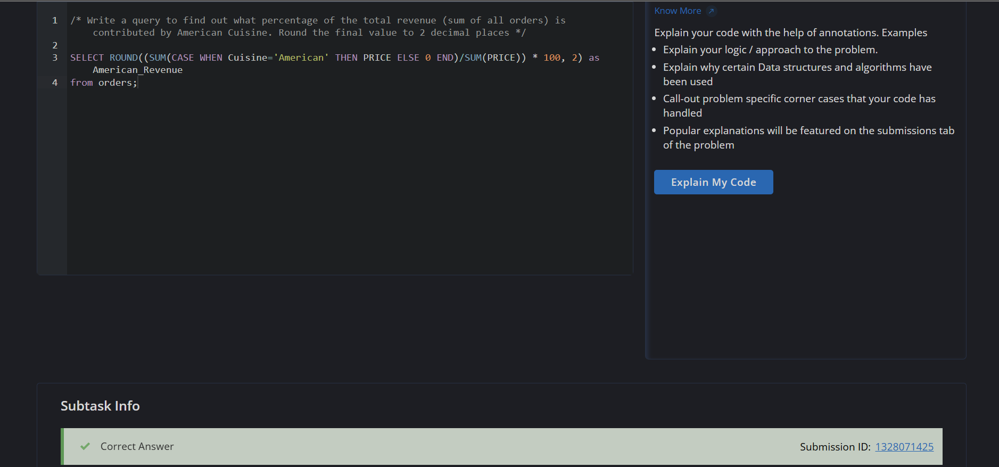
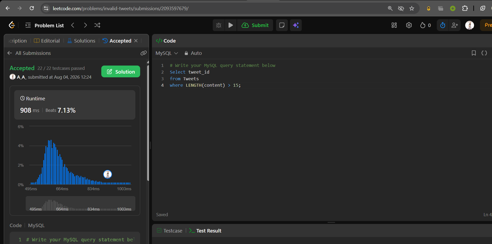

# Experiment 5 — SQL Functions & Expressions

**Course:** Advanced Database Management Systems (ADBMS)  
**Student:** Ashwin Anand  
**UID:** 25BCS80013

---

# Experiment 5.1 — Revenue Percentage Calculation

## Objective

Learn how to calculate percentages in SQL using aggregate functions. This experiment demonstrates the use of `SUM()`, arithmetic expressions, `WHERE`, and `ROUND()` to determine the percentage contribution of a specific category to the total revenue.

---

## Problem Statement

Given an `Orders` table, calculate what percentage of the **total revenue** is contributed by **American Cuisine**.

The output should:

- Calculate the total revenue generated by orders belonging to **American Cuisine**.
- Divide it by the overall revenue generated from all orders.
- Multiply by **100** to obtain the percentage.
- Round the result to **2 decimal places**.
- Alias the output column as **`American_Revenue`**.

---

## Table Schema — `Orders`

| Column | Data Type |
|---------|-----------|
| order_id | INT (Primary Key) |
| item_name | VARCHAR(255) |
| cuisine | VARCHAR(255) |
| category | VARCHAR(255) |
| price | DECIMAL(10,2) |
| status | VARCHAR(255) |

---

## SQL Query

```sql
SELECT ROUND(
       (SUM(CASE WHEN cuisine = 'American' THEN price ELSE 0 END)
       / SUM(price)) * 100,
       2
) AS American_Revenue
FROM Orders;
```

---

## Explanation

1. `CASE` checks whether the cuisine is **American**.
2. `SUM()` calculates the total revenue generated from American cuisine.
3. Another `SUM(price)` calculates the overall revenue from all orders.
4. Dividing the two values and multiplying by **100** converts the result into a percentage.
5. `ROUND(..., 2)` limits the output to **two decimal places**.
6. The result is displayed using the alias **`American_Revenue`**.

---

## Expected Output

| American_Revenue |
|-----------------:|
| 27.75 |

---

## Output Screenshot

```md

```

---

## Key Concepts Learned

| Concept | Description |
|---------|-------------|
| `SUM()` | Calculates the total of numeric values. |
| `CASE` | Performs conditional calculations within a query. |
| Arithmetic Expressions | Used to calculate percentages. |
| `ROUND()` | Rounds numeric values to a specified number of decimal places. |
| Column Alias (`AS`) | Assigns a custom name to the output column. |

---

## Formula Used

```text
Percentage Contribution =
(Revenue from American Cuisine / Total Revenue) × 100
```

---

## Tools Used

- CodeChef SQL Intermediate
- MySQL / Programiz Online SQL Compiler
- GitHub Markdown

---

# Experiment 5.2 — Invalid Tweets (String Functions)

## Objective

Understand how to use SQL string functions to validate text data. This experiment demonstrates the use of the `LENGTH()` function along with the `WHERE` clause to filter records based on the number of characters in a string.

---

## Problem Statement

Given a `Tweets` table, identify all **invalid tweets**.

A tweet is considered **invalid** if the number of characters in its `content` is **strictly greater than 15**.

Return only the `tweet_id` of invalid tweets.

**Source:** LeetCode 1683 — Invalid Tweets

**Difficulty:** Easy

---

## Table Schema — `Tweets`

| Column Name | Type |
|-------------|------|
| tweet_id | INT |
| content | VARCHAR |

- `tweet_id` is the primary key.
- `content` contains the text of the tweet.

---

## SQL Query

```sql
SELECT tweet_id
FROM Tweets
WHERE LENGTH(content) > 15;
```

---

## Explanation

1. `LENGTH(content)` calculates the total number of characters in each tweet.
2. The `WHERE` clause filters tweets whose length is greater than **15**.
3. Only the `tweet_id` of invalid tweets is returned.

---

## Example

### Input

| tweet_id | content |
|----------:|-----------------------------------|
| 1 | Let us Code |
| 2 | More than fifteen chars are here! |

### Output

| tweet_id |
|----------:|
| 2 |

---

## Output Screenshot

```md

```

---

## Key Concepts Learned

| Concept | Description |
|---------|-------------|
| `LENGTH()` | Returns the number of characters in a string. |
| `WHERE` | Filters rows based on a specified condition. |
| String Functions | Functions used to manipulate and analyze text values. |

---

## Tools Used

- LeetCode
- MySQL
- GitHub Markdown